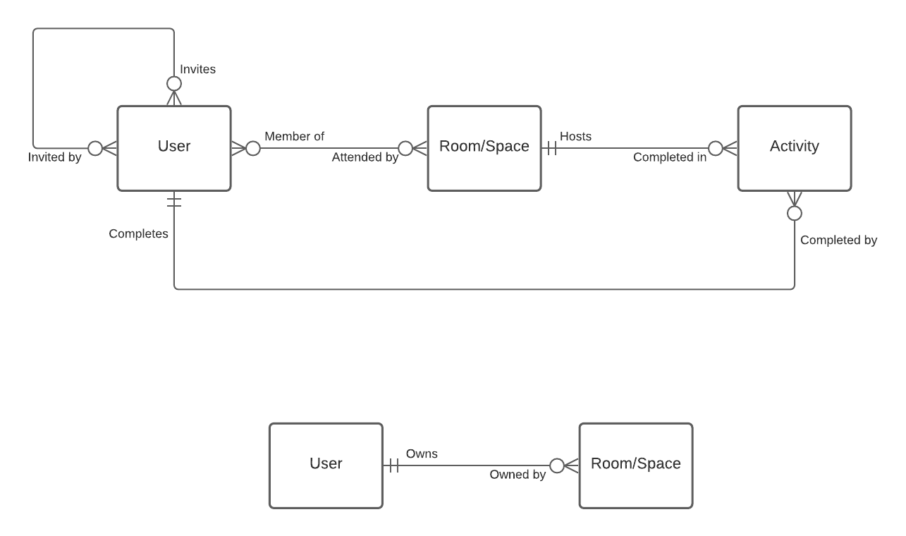
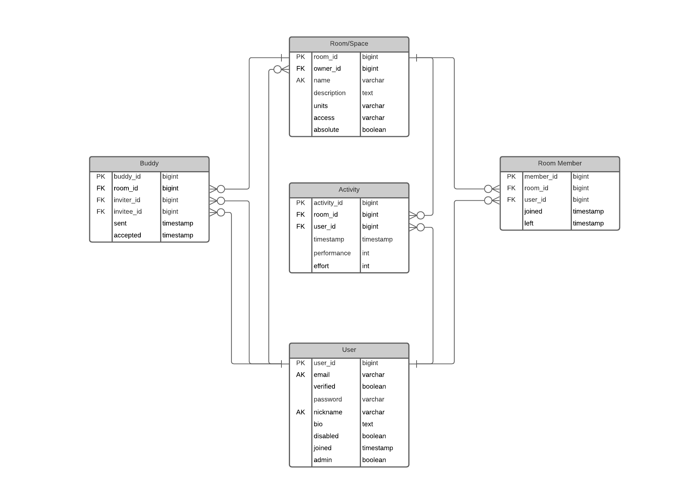
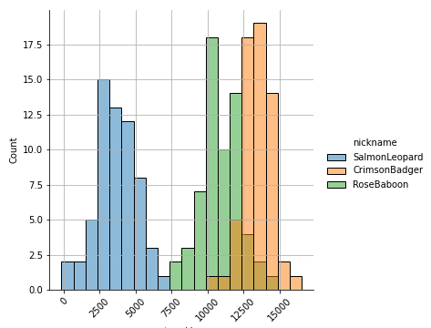
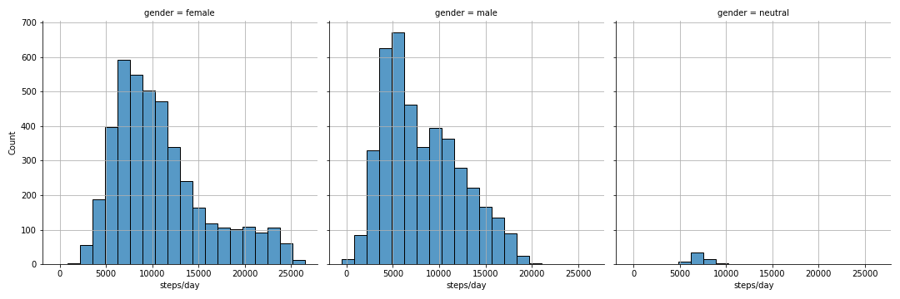
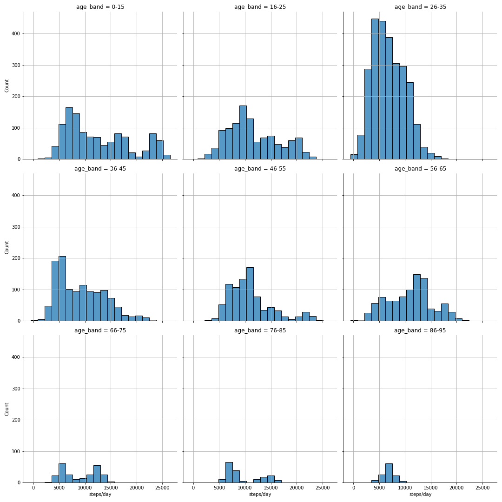
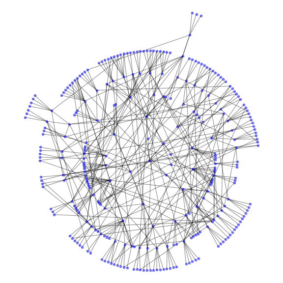

# Computer Science Project

Supporting database schema and mock data generation for the A-Level Computer
Science project.

As I've not yet seen final project requirements or a formal project
description, this should be considered an example or starting point ahead
of a detailed design. 

- [Data Model](#data-model)  
- [The Database](#the-database)
- [Usage](#usage)
- [Generated Data](#generated-data)

## Data Model

Based on some conversation and my own imagination, I've designed a simple
database around the following project description.

    Of the available exercise and diet tracking/sharing apps, most present an abundance of data, often crammed into cluttered dashboards or spread across multiple pages, screens or tabs on a mobile app. A timeline of shares, likes and virtual races being what passes for "social fitness".

    The purpose of this project is to greatly simplify the user experience of such an app by presenting personal activity trends compared with the trends of other, connected users, using the concept of an "activity room".

    Not unlike the concept of a "route" or "segment" in Strava, an activity room is a virtual space where multiple users can record their progress of a defined activity. Rooms can be open, where anyone can enter, or invitation only. Unlike Strava's segments, the concept extends to any activity, like weightlifting or racket sports.

    The activity attached to a room must have a single metric of achievement. Perhaps the number of steps completed, calories burnt or average pace for a session. Achievement could be a measurement of effort or performance, and could be absolute or relative to a user's activity history.



## The Database

The Python scripts and SQL schema in this repository assume SQLite as the database engine. SQLite is portable and built-in to Python, making it a fine choice for development, testing and demonstration.

`schema.sql` defines the tables, fields and relations represented in this entity relationship diagram.



## Usage

**Requires Python >= 3.7**

`init_db.py` initialises a new SQLite database. Run from the command line,
you'll need to pass it the new database location as an argument. For example,
this will create a new database called `project.sqlite` in the current working
directory.

```
python init_db.py project.sqlite
```

By default, `init_db.py` will generate mock data too. Pass the `--init-only`
flag to create a new, empty database without mock data.

If the database already exists, you'll be prompted to confirm that you wish to
overwrite it. Use the `--force` flag to overwrite without being prompted.

The password hashing algorithm used when generating users is a reasonably secure
one. One that is slow by design. You can speed up data generation during
development by telling `init_db.py` to use less hashing iterations with the 
`--hash-iterations` argument. For example.

```
python init_db.py --force --hash-iterations 100 project.sqlite
```

### Dump Data

`dump_db.py` will extract data from SQLite to CSV formatted files. One CSV file
per database table. For example, this command will read data from the SQLite
database named `project.sqlite` and write five CSV files to the current working
directory.

```
python dump_db.py project.sqlite .
```

## Generated Data

An attempt has been made to make the distribution of generated data seem
natural. If we sample three random users from the database, and plot a
histogram of their daily step counts for the pas two months, you can see each
user has their own average step count following a normal (gaussian)
distribution.



Similarly, performance has been skewed by gender and age.




Note that successive calls to `init_db.py` will generate different data that
follows the distributions illustrated above.

### Buddies

The `buddy` table is effectively an adjacency list for a graph where nodes are
users and edges represent an inviter/invitee relationship. The intention being
that one can do interesting path finding algorithms between users.

Here's a fairly useless illustration of one random `buddy` table generated with
`init_db.py`.

